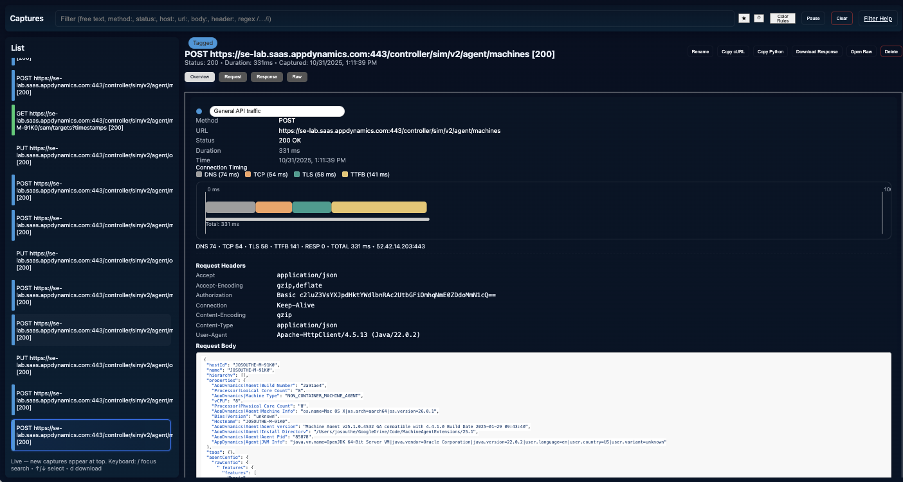
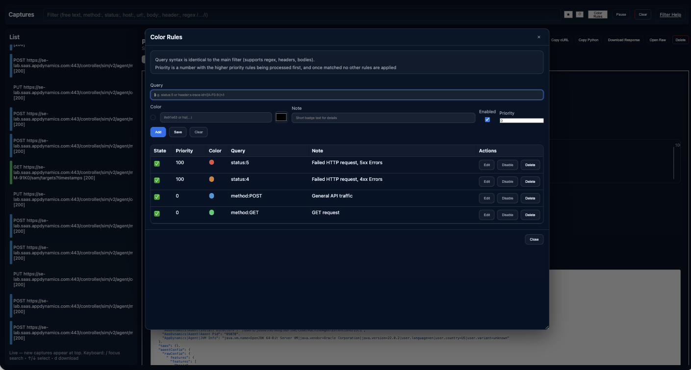

# HTTP Breakout Proxy

A lightweight HTTP/HTTPS intercepting proxy and traffic analysis tool written in Go, with a web-based UI for inspecting, filtering, coloring, and annotating captured traffic in real time.




---

## Overview

**HTTP Breakout Proxy** functions as both an HTTP and HTTPS MITM proxy and a live visualization tool.  
It captures requests and responses between two software components, allowing developers to:

- Inspect headers, bodies, and timing details for each request and response.
- Organize, filter, and persist captured data.
- Highlight requests based on user-defined **color rules**.
- Pause or resume capture dynamically.
- View request timing as a **Gantt chart** to visualize performance phases.

The proxy embeds a full-featured UI accessible from any modern web browser, enabling immediate, real-time analysis without external tools.

---

## Features

### 🔍 Capture and Inspection
- Intercepts both HTTP and HTTPS traffic (with MITM CA support).
- Displays all request and response metadata, headers, and bodies.
- Supports truncation for very large bodies.

### 💾 Persistence
- Captures and color rules are stored in `captures.json` (or specified file).
- Automatically reloads state at startup and periodically saves to disk.
- Default color rules are generated on first run if none exist.

### 🖥️ Web UI
- Responsive embedded web interface (served by the proxy itself).
- Displays captures in a scrollable list with color-coded indicators.
- Details panel shows:
    - Request and response headers/bodies
    - Timing breakdowns
    - Editable notes
    - Gantt-style performance chart for connection phases

### 🎨 Color Rules
- Define conditional color highlights for captures using flexible filter syntax:
    - Example: `status:4 status:5` → highlights HTTP errors
    - Example: `url:/api/` → highlights API requests
    - Example: `/\.css$/` → regex match on URL
- Each rule includes:
    - Name, color, match expression, priority, and note
- Highest-priority match wins.
- Managed interactively through a modal UI with live previews.
- Persisted across sessions.

### ⏸️ Capture Control
- **Pause/Resume** button allows you to stop collecting new captures without stopping the proxy.
- Useful when focusing on a fixed dataset or isolating specific behavior.

### 📈 Performance Visualization
- Each capture includes detailed connection timing:
    - DNS lookup
    - TCP connect
    - TLS handshake
    - Server processing
    - Response read
- Displayed as a Gantt chart in the details panel.
- Scale automatically rounds to the nearest second for readability.

### 🧭 Filtering and Search
- Real-time filter box supporting:
    - Field-based filters (`method:GET`, `status:404`, `header:Content-Type=application/json`)
    - Regex expressions (`/login/`)
    - Combined terms with AND/OR semantics
- Case-insensitive and partial matching supported.
- Filter applies both to the capture list and color highlighting.
- Search history stored locally in the browser.

### 🧹 Management
- Delete individual captures or clear all captures via UI.
- Rules and notes are persisted along with captures.

### 🧩 Export Utilities
- Copy a capture as:
    - `curl` command (formatted for terminal)
    - `python requests` code snippet (clean JSON representation)
- Download response bodies directly from the UI.

---

## Command Line Usage

```bash
httpbreakout  -l 127.0.0.1:8080
````
  
## Quick Start

### Build (from source)

```bash
git clone https://github.com/jbsouthe/http-breakout-proxy.git
cd http-breakout-proxy
go build -o http-breakout-proxy
```

This produces a single executable that contains the compiled proxy and the embedded UI assets.

### Run (default)

```bash
# run with defaults (proxy + UI)
./http-breakout-proxy
```

By default the binary binds to `127.0.0.1:8080` for proxying (and optionally UI — see CLI flags). Open the UI in a browser to inspect captures.

### Example: exercising the proxy with curl

```bash
# send an HTTPS request via the proxy (proxy listens on 127.0.0.1:8080)
curl -x http://127.0.0.1:8080 https://example.com
```

Captured traffic will appear in the web UI.

---

## Command-Line Arguments

| Flag           | Default          | Description                                                                                                    |
|----------------|------------------|----------------------------------------------------------------------------------------------------------------|
| `-l`           | `127.0.0.1:8080` | Address for the proxy to listen on as well as a UI app.                                                        |
| `-mitm`        | `true`           | Enable HTTPS Man In The Middle mode (MITM) interception (generates a local CA for intercepting TLS).           |
| `-ca`          | `./ca`           | Directory in which generated CA certificate and key are stored when MITM is enabled and persistence is chosen. |
| `-f`           | `./captures.json`  | Optional path or directory for persisting captures to disk (e.g., `./captures.json`).                          |
| `-max-body`    | `1048576`        | Maximum number of bytes (per body) to store/display; larger bodies are truncated with a sentinel.              |
| `-buffer-size` | `1000`           | Circular buffer capacity for in-memory captures.                                                               |
| `-v`           | `false`          | Enable verbose logging for debugging.                                                                          |

> Use `./http-breakout-proxy -h` to list available flags and usage descriptions.

---

## Web UI Overview

The UI is optimized for investigative workflows.

- **Top toolbar**: global filter input (supports regex and keyed prefixes), Pause/Resume capture, Clear, and Filter Help (opens in a new tab).
- **Left panel**: chronological capture listing (newest first). Each item shows the capture name; by default this is `METHOD URL [STATUS]` but a custom name can be assigned.
- **Right panel**: details for the selected capture:
    - **Overview**: metadata, headers, and bodies (formatted JSON where applicable).
    - **Request** / **Response** tabs: raw formatted bodies.
    - **Raw** tab: full capture JSON.
- **Row actions**: copy as `curl`, copy as Python `requests`, download response body, rename, delete.

---

## Filter Language (Short Reference)

- Plain token: matches anywhere (method, URL, status, host, headers, bodies).
- Prefixes: `method:`, `status:`, `host:`, `url:`, `body:`, `req.body:`, `resp.body:`, `header:`, `req.header:`, `resp.header:`.
- Regex syntax: `/pattern/flags` (for example `/bearer\\s+\\S+/i`).
- Header spec: `header:name=value` where `name` or `value` can be regexes.
- Terms are combined with logical **AND** by default (space separated). Switch to OR if desired by altering client logic.

Examples:
- `method:POST status:2 host:api.example.com`
- `/token\\s*[:=]\\s*\\S+/i`
- `req.header:authorization=/bearer/i`
- `body:/\\"success\\"\\s*:\\s*true/i`

---

## HTTPS Interception (MITM)

When Man In The Middle mode is enabled:

1. The proxy generates an RSA CA key pair and a root certificate and stores them in `-ca` (default `./ca`).
2. To inspect HTTPS traffic you must add the generated CA certificate (`ca.pem` or similar) to the trust store of the client (or system) issuing requests. On many platforms this requires administrative privileges.
3. The proxy performs TLS interception by issuing leaf certificates signed by the local CA for each hostname requested by the client.

**Security note:** Only install the CA in controlled environments. Do not trust this CA in systems where you read sensitive unrelated traffic.

---

## Persistence

If persistence is enabled (via `-f` or configured path):

- Captures are periodically written to disk (e.g., `captures.json`).
- On startup, the application will attempt to load prior captures from the persistence file into the in-memory buffer (preserving ordering).
- Renames and deletions are synchronized to the persisted store on save operations; consider invoking an immediate flush for critical operations.

---

## Storage Format

Captured items are serialized to JSON and contain the following fields (non-exhaustive):

- `id` — unique sequence identifier
- `time` — timestamp (ISO 8601)
- `method`, `url`
- `request_headers`, `response_headers`
- `request_body`, `response_body` — truncated to `-max-body` if necessary
- `response_status`, `duration_ms`
- `name` — optional user label
- `notes`, `deleted` — control metadata for SSE events and UI state

---

## Export and Replay Helpers

- **Copy as cURL**: builds a shell-safe `curl` command including headers and body (omits hop-by-hop headers).
- **Copy as Python**: produces a small `requests` snippet with `url`, `headers`, and optional `data`.
- **Download**: saves response body to a file; extension inferred from `Content-Type` when possible.

**Design considerations:**
- Hop-by-hop headers (e.g., `Host`, `Content-Length`, `Connection`) are omitted from generated replay commands.
- Binary response bodies (images, PDFs) are downloadable using binary blobs. If responses are stored Base64-encoded, the client will decode before download.

---

## API: REST Endpoints (for automation)

- `GET /api/captures` — list captures (JSON array).
- `DELETE /api/captures` — clear all captures.
- `GET /api/captures/{id}` — retrieve a single capture.
- `DELETE /api/captures/{id}` — delete specific capture.
- `PATCH /api/captures/{id}` — update capture metadata; body example: `{ "name": "My label" }`.
- `GET /api/pause` — returns `{ "paused": true|false }`.
- `POST /api/pause` — set paused state; body example: `{ "paused": true }`.
- `GET /events` — Server-Sent Events (SSE) stream for live capture notifications and control events.

---

## Implementation Notes (for developers)

- **Embedding UI**: use `//go:embed ui/*` and `fs.Sub` to serve static files. This produces a single deployable artifact.
- **Decompression**: capture code checks `Content-Encoding` and attempts to decompress `gzip` and `deflate` bodies before display. The original bytes are retained for proxy transparency.
- **Concurrency**: capture store uses internal locking to provide thread-safe append/list/get/update operations. Where possible atomic booleans are used for toggle flags (e.g., pause/resume).
- **SSE**: a lightweight broker broadcasts capture additions, deletions, renames, and control events to connected UI clients.
- **Buffering**: capture bodies are read using `io.LimitReader` to detect truncation and protect memory usage.

---

## Packaging & Distribution

Recommended distribution model:

1. Build static, trimmed binaries for target platforms (`CGO_ENABLED=0`, `-trimpath`, `-ldflags "-s -w"`).
2. Produce archives (`.tar.gz` for Unix, `.zip` for Windows) and include `README.md` and `LICENSE`.
3. Provide SHA-256 checksums and attach artifacts to GitHub Releases.
4. Optionally use `goreleaser` to automate cross-platform builds and release artifacts.

Example build commands:

```bash
# Linux x86_64
GOOS=linux GOARCH=amd64 CGO_ENABLED=0 go build -trimpath -ldflags "-s -w" -o dist/http-breakout-proxy-linux-amd64 .

# macOS (arm64)
GOOS=darwin GOARCH=arm64 CGO_ENABLED=0 go build -trimpath -ldflags "-s -w" -o dist/http-breakout-proxy-darwin-arm64 .
```

---

## Running as a Service

### systemd unit (Linux example)

```ini
[Unit]
Description=HTTP Breakout Proxy
After=network.target

[Service]
ExecStart=/opt/http-breakout-proxy/http-breakout-proxy -l 0.0.0.0:8080
Restart=on-failure
User=proxy
Group=proxy

[Install]
WantedBy=multi-user.target
```

### launchd (macOS user agent)
Create a `plist` in `~/Library/LaunchAgents` and load with `launchctl`.

---

## Troubleshooting

- **Captured body appears as binary gibberish**  
  The body is compressed (e.g., `gzip`). Ensure you are running a build that includes automatic decompression; the UI shows decompressed JSON/text when available.

- **HTTPS traffic not displayed / connection errors**  
  The client does not trust the generated CA. Install `ca/ca.pem` into the client/system trust store and mark as trusted for TLS interception.

- **UI shows stale selection after clearing captures**  
  Upgrade to a client that clears `selectedId` on `cleared` SSE events or invoke the `GET /api/captures` endpoint to refresh state.

- **405 on `DELETE /api/captures`**  
  Ensure the server handler accepts `DELETE` for `/api/captures` and you are not hitting a trailing-slash mismatch.

---

## Security & Privacy

This tool performs TLS interception when MITM is enabled. Use it only in controlled environments where you have explicit authorization to inspect traffic. The generated CA is powerful: treat its private key with the same confidentiality as any other root CA private key. Do not install the CA in shared or production trust stores.

---

## Contributing

Contributions are welcome. Please open issues for bugs or feature requests. For code contributions:

1. Fork the repository.
2. Create a feature branch.
3. Run unit tests and linters where applicable.
4. Submit a pull request describing the change, rationale, and any backward-compatibility concerns.

---

## License

This project is distributed under the **MIT License**. See `LICENSE` for details.

---

## Attribution & Contact

Author: John Southerland (GitHub: `jbsouthe`)  
Project: `http-breakout-proxy` — intended for debugging, development, and learning about HTTP behavior.
